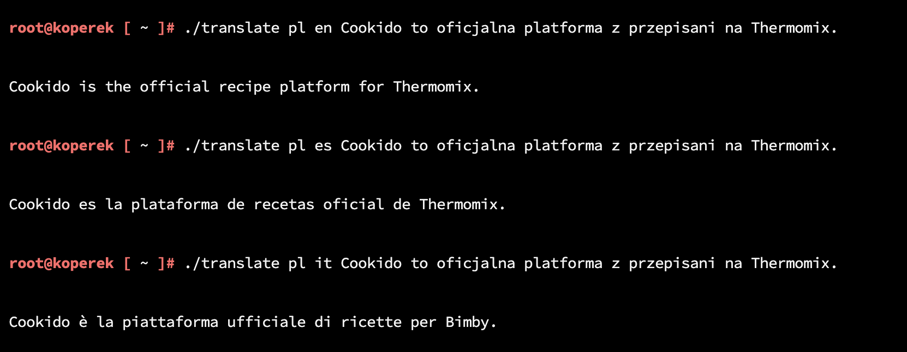

# cli-google-translator

Simple script to translate using google translate engine on your linux console. 
Just download translate script and grant executable permission 

Usage: 
./translate {FROM} {TO} {WHAT} 

